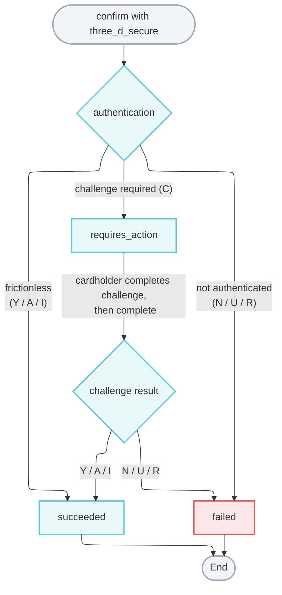

import { Alert } from "@site/src/components/shared/Alert";

# 3D Secure

3D Secure (3DS) is an authentication step that runs before a card payment is authorized. The cardholder's issuing bank verifies that the person making the purchase is the legitimate cardholder—either silently (**frictionless**) or by presenting a **challenge** such as a one-time passcode or a banking-app push.

Credova implements 3DS 2.x using [Basis Theory](https://basistheory.com) as the 3DS Server and passes the resulting authentication values to the processor on a single payment submission. 3DS layers onto the existing [Payment Intents](/api/financial/create-payment-intent) flow and provides you the flexibility to opt in per intent at `confirm` time.

**Why use it:** a successful 3DS authentication shifts chargeback liability from you to the issuer and is mandatory for Strong Customer Authentication (SCA) on in-scope EU/UK transactions.

<Alert type="warning">3DS is gated per account and is off by default. Contact Credova to enable 3DS on your account before integrating.</Alert>

## Transports

There are two ways to present 3DS to the cardholder. Both share the same `confirm` → `complete` API flow and differ only in how the session is created and how a challenge is rendered.

| Factor                       | Iframe                                                     | Redirect                                          |
|------------------------------|------------------------------------------------------------|---------------------------------------------------|
| Session created              | In the browser, via the Elements SDK                       | Server-side, by Credova at `confirm`         |
| Device fingerprint quality   | Real (browser-collected) — higher frictionless rate        | Approximated — lower frictionless rate            |
| Challenge presentation       | ACS iframe embedded in your page (state preserved)         | Full-page navigation to a hosted page             |
| Merchant routes required     | None                                                       | Two callback routes (success + failure)           |
| JS SDK dependency            | Required (`@publicsquare/elements-js` / `-react`)          | None                                              |
| Mobile webview compatibility | Can be blocked by some webviews                            | Universal                                         |
| Best for                     | Standard web checkouts (default)                           | Native webviews, server-rendered checkouts        |

See [Process 3DS Payments (Iframe)](/guides/payments/process-3ds-iframe-payments) and [Process 3DS Payments (Redirect)](/guides/payments/process-3ds-redirect-payments) for step-by-step walkthroughs.

## Glossary

| Term                | Meaning                                                                       |
|---------------------|-------------------------------------------------------------------------------|
| **3DSS**            | 3DS Server — initiates authentication on the merchant's behalf (Basis Theory) |
| **ACS**             | Access Control Server — the issuer's challenge endpoint                       |
| **Frictionless**    | Authentication completes with no cardholder interaction                       |
| **Challenge**       | Cardholder must complete an ACS-hosted step (OTP, biometric, bank app)        |
| **Liability shift** | Chargeback liability moves from merchant to issuer on success                 |

## Anatomy

### Confirm request

[//]: # (Passed on [Confirm Payment Intent]&#40;/api/financial/confirm-payment-intent&#41; to start 3DS.)
Send the `three_d_secure` field as part of the `confirm` call. See [Confirm Payment Intent](/api/financial/confirm-payment-intent) for more details.

| Field                      | Description                                                                                                       |
|----------------------------|-------------------------------------------------------------------------------------------------------------------|
| `transport`                | **Required.** `iframe` or `redirect`.                                                                             |
| `session_id`               | Iframe only. The Credova 3DS session id (`id`) returned by the Elements SDK `createSession`.                 |
| `success_url`              | Redirect only. Where the cardholder is returned after a successful challenge.                                     |
| `failure_url`              | Redirect only. Where the cardholder is returned on a failed/cancelled challenge.                                  |
| `challenge_preference`     | Optional. See [Challenge preference](#challenge-preference).                                                      |
| `exemption_request_reason` | Required when `challenge_preference` is `exemption-requested`. See [Challenge preference](#challenge-preference). |

### Next action

When a challenge is required, `confirm` returns the intent in `requires_action` status with

| Field                | Description                                                        |
|----------------------|--------------------------------------------------------------------|
| `session_id`         | The 3DS session id. Pass this back to `complete`.                  |
| `transport`          | `iframe` or `redirect`.                                            |
| `acs_challenge_url`  | Iframe only. URL the SDK loads to render the challenge.            |
| `acs_transaction_id` | Iframe only. Identifies the ACS transaction for the SDK.           |
| `three_ds_version`   | Iframe only. The 3DS protocol version, e.g. `2.2.0`.               |
| `redirect_url`       | Redirect only. Navigate the browser here to present the challenge. |

### 3DS session

Created in the browser by the Elements SDK `createSession` (which also registers it with Credova) and retrievable via [Get 3DS Session](/api/financial/3-ds-get-by-id).

| Field                    | Description                                                                                    |
|--------------------------|------------------------------------------------------------------------------------------------|
| `id`                     | The **Credova** session id. Pass this to `confirm` and `complete`.                        |
| `bt_session_id`          | The underlying session id used to render the challenge iframe (the SDK challenge `sessionId`). |
| `card_brand`             | Detected card brand.                                                                           |
| `additional_card_brands` | Any co-badged brands.                                                                          |
| `acs_transaction_id`     | ACS transaction identifier.                                                                    |

```json showLineNumbers title="3DS Session"
{
  "id": "tds_2YKewBonG4tgk12MheY3PiHDy",
  "bt_session_id": "0e5a...c1",
  "card_brand": "visa",
  "additional_card_brands": ["cartes_bancaires"],
  "acs_transaction_id": "f3e8a1b2-..."
}
```

<Alert>Two ids are in play: the Credova `id` drives the `confirm`/`complete` API calls, and `bt_session_id` drives the in-page challenge.</Alert>

## Lifecycle



The issuer returns one of these authentication status codes. Codes that authenticate the cardholder allow the payment to proceed to the processor; the rest fail the payment.

| Code | Meaning                | Outcome                                                |
|------|------------------------|--------------------------------------------------------|
| `Y`  | Successful             | Authenticated — full liability shift, payment proceeds |
| `A`  | Attempted              | Authenticated — no liability shift, payment proceeds   |
| `I`  | Informational          | Authenticated — payment proceeds                       |
| `C`  | Challenge required     | Render the challenge, then call `complete`             |
| `N`  | Not authenticated      | Payment fails                                          |
| `U`  | Unable to authenticate | Payment fails                                          |
| `R`  | Rejected               | Payment fails                                          |

## Challenge preference

`challenge_preference` lets you express how you'd like the issuer to handle the authentication. Most integrations omit it (defaults to no preference).

| Value                  | Use when                                                                                   |
|------------------------|--------------------------------------------------------------------------------------------|
| `no-preference`        | Standard transaction, no specific exemption requested.                                     |
| `no-challenge`         | You'd prefer a frictionless flow but aren't claiming a regulatory exemption.               |
| `challenge-requested`  | You want to force a challenge (e.g. high-ticket transactions).                             |
| `exemption-requested`  | You're claiming a regulatory SCA exemption. Requires `exemption_request_reason`.           |

When `challenge_preference` is `exemption-requested`, set `exemption_request_reason` to one of: `low-value-payment`, `transaction-risk-analysis`, `add-card`, `account-verification`.

## Testing

3DS authentication is triggered automatically by the card number used. Use any future expiration date, any CVV, and any billing ZIP. These test cards are available in the `test` environment.

| Scenario                   | Card number        | Brand      | Expected result             |
|----------------------------|--------------------|------------|-----------------------------|
| Frictionless success       | `5204247750001471` | Mastercard | `succeeded`, no challenge   |
| Frictionless success       | `340000000004001`  | Amex       | `succeeded`, no challenge   |
| Challenge success          | `4000020000000000` | Visa       | challenge → `succeeded`     |
| Challenge success          | `370000000000002`  | Amex       | challenge → `succeeded`     |
| Mandated challenge         | `4761369980320253` | Visa       | challenge → `succeeded`     |
| Mandated challenge         | `5200000000001104` | Mastercard | challenge → `succeeded`     |
| Out-of-band challenge      | `4000000000000341` | Visa       | challenge → `succeeded`     |
| Authentication attempted   | `4111111111111111` | Visa       | `succeeded` (partial shift) |
| Authentication attempted   | `5424180011113336` | Mastercard | `succeeded` (partial shift) |
| Authentication failed      | `4264281511112228` | Visa       | `failed`                    |
| Authentication failed      | `5424180000000171` | Mastercard | `failed`                    |
| Authentication unavailable | `5405001111111165` | Mastercard | `failed`                    |
| Authentication rejected    | `5405001111111116` | Mastercard | `failed`                    |
| Failed challenge           | `4055011111111111` | Visa       | challenge → `failed`        |
| Failed challenge           | `5427660064241339` | Mastercard | challenge → `failed`        |
| Directory server error     | `4264281500003339` | Visa       | `failed` (error surfaced)   |
| Internal server error      | `4264281500001119` | Visa       | `failed` (error surfaced)   |

## Where to go next

- [Process 3DS Payments (Iframe)](/guides/payments/process-3ds-iframe-payments) — in-page challenge with the Elements SDK
- [Process 3DS Payments (Redirect)](/guides/payments/process-3ds-redirect-payments) — hosted challenge via full-page redirect
- [Confirm Payment Intent](/api/financial/confirm-payment-intent) — API reference
- [Complete Payment Intent 3DS Challenge](/api/financial/complete-payment-intent-3-ds-challenge) — API reference
- [Get 3DS Session](/api/financial/3-ds-get-by-id) — API reference
