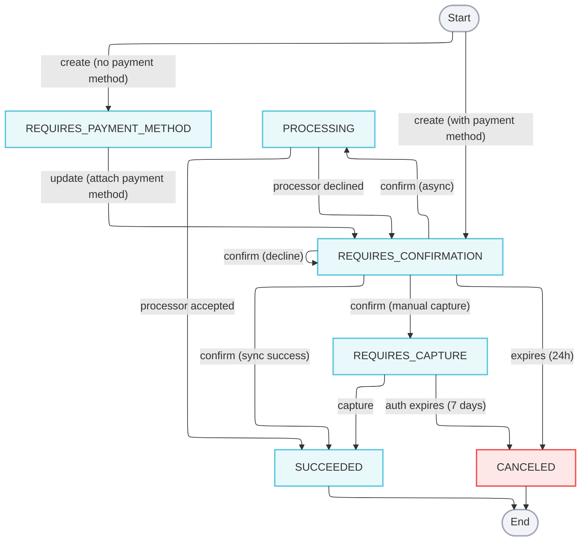

import { Alert } from "@site/src/components/shared/Alert";

# Payment Intents

A Payment Intent represents your intent to collect funds from a customer, giving you a durable, stateful handle on a charge across its full lifecycle. From creation through confirmation, processing, and final outcome, the intent tracks every transition and makes the terminal result available — whether synchronously in the confirm response or asynchronously via webhook.

Payment Intents are recommended for all new integrations. They provide two key advantages over the direct Payments API:

**Idempotent retries.** The intent ID (`pmt_int_`) is assigned at creation. Persist it in your database before confirming, and you can safely retry on network failures or timeouts — the same intent cannot be confirmed twice, eliminating duplicate charge risk.

**Async-safe outcomes.** When a processor takes longer to respond, confirm returns `202 processing` instead of timing out. The final result arrives via webhook, so your integration never has to guess.

For step-by-step implementation, see the [Process Card Payments](/guides/payments/process-card-payments) guide.

## Payment Intents vs Legacy

| | Payment Intents | Legacy (`POST /payments`) |
|---|---|---|
| **Flow** | Create → Confirm (→ Capture) | Single request |
| **Outcome** | `200 succeeded` or `202 processing` + webhook | Immediate terminal result |
| **Retry safety** | Idempotent by intent ID | IDEMPOTENCY-KEY header only |
| **Async support** | Built-in via `processing` state | Not supported |
| **Authorize & capture** | `capture_method: manual` | `capture: false` |
| **Decline handling** | Re-confirm same intent with new card | Create a new payment |

## Anatomy

### Intent fields

| Field | Description |
|---|---|
| `id` | Unique identifier for this intent. Prefix: `pmt_int_`. |
| `account_id` | The merchant account that owns the intent. |
| `environment` | `test` or `production`. |
| `status` | Current lifecycle status. See [Lifecycle states](#lifecycle-states). |
| `amount` | Charge amount in cents. |
| `currency` | Three-character ISO currency code, e.g. `USD`. |
| `capture_method` | `automatic` (default) or `manual`. |
| `payment_method` | The attached card or bank account. `null` if not yet provided. |
| `payment_id` | ID of the resulting `Payment` record. Populated once `succeeded`. Prefix: `pmt_`. |
| `last_payment_error` | Populated when a confirm attempt is declined. Contains `code` and `message`. |
| `expires_date` | ISO 8601 timestamp after which the intent auto-cancels. |
| `created_date` | ISO 8601 timestamp. |
| `modified_date` | ISO 8601 timestamp. |

### Sample intent

```json showLineNumbers title="Payment Intent"
{
  // highlight-next-line
  "id": "pmt_int_2xNjK7abcdefghij",
  "account_id": "acc_B518niGwGYKzig6vtrRVZGGGV",
  "environment": "test",
  // highlight-next-line
  "status": "requires_confirmation",
  "amount": 1000,
  "currency": "USD",
  "capture_method": "automatic",
  "payment_method": {
    "card": {
      "id": "card_AjkCFKAYiTsjghXWMzoXFPMxj",
      "last_four": "4242",
      "brand": "visa",
      "exp_month": "12",
      "exp_year": "2025"
    }
  },
  "payment_id": null,
  "last_payment_error": null,
  "expires_date": "2026-04-16T14:22:10Z",
  "created_date": "2026-04-15T14:22:10Z",
  "modified_date": "2026-04-15T14:22:10Z"
}
```

## Lifecycle states



| Status | Description |
|---|---|
| `requires_payment_method` | The intent was created without a payment method. Call [Update Payment Intent](/api/financial/update-payment-intent) to attach a card or bank account. |
| `requires_confirmation` | A payment method is attached and the intent is ready to confirm. This is also the state the intent returns to after a decline — attach a new payment method and re-confirm the same intent. |
| `processing` | The charge was submitted to the processor and the response is pending. Subscribe to the `payment_intent:update` webhook to receive the final outcome. |
| `requires_capture` | The card was authorized with `capture_method: manual`. The authorization holds funds for up to 7 days. Call [Capture Payment Intent](/api/financial/capture-payment-intent) to complete the charge. |
| `succeeded` | The charge was accepted. `payment_id` is populated with the resulting `Payment` record. Terminal state. |
| `canceled` | The intent was not confirmed within 24 hours, or a `requires_capture` authorization was not captured within 7 days. Terminal state. |

<Alert type="warning">An intent in `requires_capture` automatically moves to `canceled` if not captured before the `expires_date`. A `canceled` intent cannot be reactivated — create a new one.</Alert>

## Error responses

### API errors

API errors follow the [RFC 7807 Problem Details](/api/errors) format. The most relevant codes for Payment Intent operations:

| HTTP Status | When it occurs |
|---|---|
| `400 Bad Request` | Invalid request body, or an operation not valid for the intent's current state (e.g. capturing a non-authorized intent). |
| `401 Unauthorized` | Missing or invalid `X-API-KEY`. |
| `403 Forbidden` | API key lacks the required `payment:write` permission. |
| `404 Not Found` | Intent ID does not exist or belongs to a different account. |
| `409 Conflict` | A concurrent operation is already in flight on this intent (e.g. two simultaneous confirm calls). |
| `422 Unprocessable Entity` | The request is structurally valid but cannot be processed — for example, confirming an intent that is already `succeeded`. |

### Payment declines

When the processor declines a charge, the intent returns to `requires_confirmation` status rather than moving to a terminal error state. The `last_payment_error` field is populated with the decline reason:

```json showLineNumbers title="Declined Payment Intent"
{
  "id": "pmt_int_2xNjK7abcdefghij",
  "account_id": "acc_B518niGwGYKzig6vtrRVZGGGV",
  "environment": "test",
  // highlight-next-line
  "status": "requires_confirmation",
  // highlight-next-line
  "last_payment_error": {
    // highlight-next-line
    "code": "card_declined",
    "message": "Your card was declined."
  },
  "amount": 1000,
  "currency": "USD",
  "payment_id": null,
  "created_date": "2026-04-15T14:22:10Z",
  "modified_date": "2026-04-15T14:22:45Z"
}
```

You can attach a different payment method to the same intent and re-confirm — no need to create a new intent. Common `last_payment_error.code` values:

| Code | Description |
|---|---|
| `card_declined` | General decline from the issuing bank. |
| `insufficient_funds` | Card has insufficient funds. |
| `expired_card` | Card expiration date has passed. |
| `incorrect_cvc` | CVC verification failed. |
| `do_not_honor` | Issuer declined without a specific reason. |

## Webhooks

Every status transition on a Payment Intent emits a `payment_intent:update` event to any webhooks registered on your account. The `entity` field contains the full intent at the time of the notification.

```json showLineNumbers title="Webhook event: payment_intent:update"
{
  "id": "evnt_5jxWRFNLCAWeegrkCAG3a9DGc",
  "account_id": "acc_B518niGwGYKzig6vtrRVZGGGV",
  "environment": "production",
  // highlight-next-line
  "event_type": "payment_intent:update",
  "entity_type": "PaymentIntent",
  "entity_id": "pmt_int_2xNjK7abcdefghij",
  "entity": {
    "id": "pmt_int_2xNjK7abcdefghij",
    "account_id": "acc_B518niGwGYKzig6vtrRVZGGGV",
    "environment": "production",
    // highlight-next-line
    "status": "succeeded",
    "amount": 1000,
    "currency": "USD",
    // highlight-next-line
    "payment_id": "pmt_5mBpT2ghiklmnopq",
    "last_payment_error": null,
    "succeeded_date": "2026-04-15T14:22:45Z",
    "created_date": "2026-04-15T14:22:10Z",
    "modified_date": "2026-04-15T14:22:45Z"
  },
  "created_at": "2026-04-15T14:22:45Z"
}
```

Check `entity.status` to determine the final outcome. Webhooks fire on every transition, including intermediate states like `processing` and `requires_capture`, not only terminal states.

<Alert>Register a webhook for `payment_intent:update` if your integration may receive `202 processing` responses from confirm. Without it, you will need to poll [Get Payment Intent](/api/financial/get-payment-intent-by-id) to detect the terminal state.</Alert>

See [Webhooks](/concepts/webhooks) for delivery guarantees, retry behavior, and signature verification.

## Where to go next

- [Process Card Payments](/guides/payments/process-card-payments) — step-by-step guide for create and confirm
- [Authorize and Capture Payments](/guides/payments/authorize-and-capture-payments) — guide for `capture_method: manual`
- [Create Payment Intent](/api/financial/create-payment-intent) — API reference
- [Confirm Payment Intent](/api/financial/confirm-payment-intent) — API reference
- [Capture Payment Intent](/api/financial/capture-payment-intent) — API reference
- [Webhooks](/concepts/webhooks) — delivery and signing details
