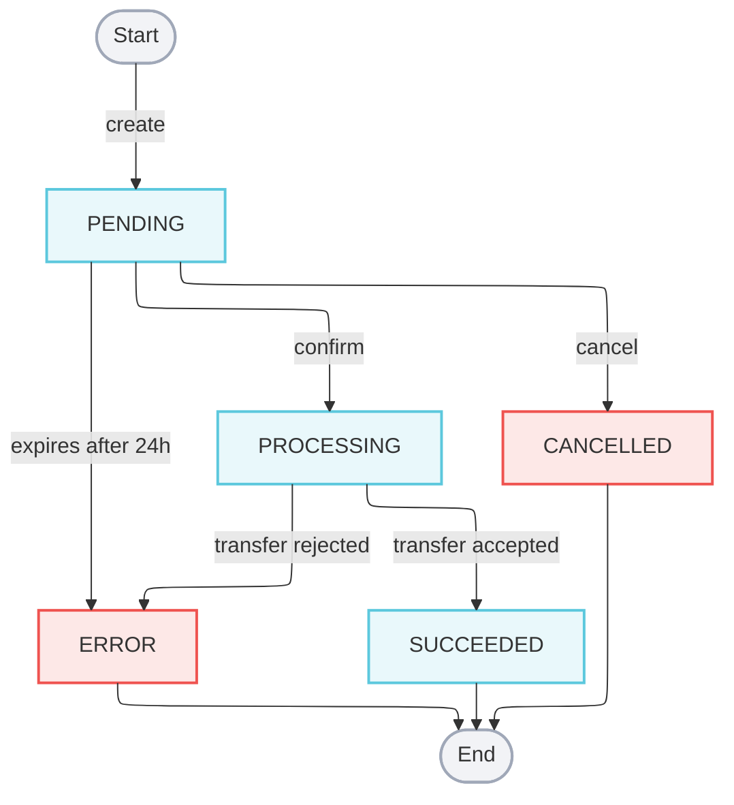

import { Alert } from "@site/src/components/shared/Alert";

# Payment Transfer Intents

A Payment Transfer Intent represents your intent to route funds from an existing payment to a seller, giving you a durable handle on the transfer across its full lifecycle. Standard Payment Transfers execute immediately; intents decouple creation from submission, so you can persist, validate, and commit on your own terms.

Intents provide two key advantages:

**Idempotent retries.** PublicSquare assigns the `payment_transfer_id` and all line-item IDs the moment an intent is created. Persist these IDs in your database before committing, and you can safely retry on network failures or timeouts—the same intent cannot be committed twice, eliminating any risk of double-paying a seller.

**Inspect before you commit.** Funds don't move until you explicitly commit the intent. That gives you room to validate the payload, surface it for review, or cancel outright—useful for compliance checks, manual approval flows, or anywhere you want certainty before money leaves your account.

For a complete walkthrough, see the [Transfer Funds to Sellers](/guides/marketplaces/transfer-funds-to-sellers) guide.

## Anatomy

A Payment Transfer Intent has two levels: the intent itself and its items.

### Intent fields

| Field                 | Description                                                                                     |
|-----------------------|-------------------------------------------------------------------------------------------------|
| `id`                  | Unique identifier for this intent. Prefix: `trnf_int_`.                                         |
| `account_id`          | The merchant account that owns the intent.                                                      |
| `environment`         | `test` or `production`.                                                                         |
| `status`              | Current lifecycle status. See [Lifecycle states](#lifecycle-states).                            |
| `payment_id`          | The captured payment this transfer will draw from.                                              |
| `payment_transfer_id` | Pre-generated ID of the payment transfer that will be created on confirmation. Prefix: `trnf_`. |
| `currency`            | Three-character ISO currency code, e.g. `USD`.                                                  |
| `total_amount`        | Sum of all item amounts, in cents.                                                              |
| `external_id`         | Optional ID from your own system for cross-reference.                                           |
| `items`               | Array of line items. See [Item fields](#item-fields).                                           |
| `created_at`          | ISO 8601 timestamp.                                                                             |
| `modified_at`         | ISO 8601 timestamp.                                                                             |

### Item fields

| Field                      | Description                                                     |
|----------------------------|-----------------------------------------------------------------|
| `id`                       | Unique identifier for this item. Prefix: `trfi_int_`.           |
| `seller_account_id`        | Seller account that will receive the funds.                     |
| `payment_transfer_item_id` | Pre-generated ID of the payment transfer item. Prefix: `trfi_`. |
| `amount`                   | Amount in cents to transfer to this seller.                     |
| `transfer_fee`             | Optional platform fee in cents deducted from the transfer.      |
| `external_id`              | Optional ID from your own system.                               |

### ID prefix reference

| Prefix      | Entity                                                   |
|-------------|----------------------------------------------------------|
| `trnf_int_` | Payment transfer intent                                  |
| `trfi_int_` | Payment transfer intent item                             |
| `trnf_`     | Pre-generated payment transfer (created on confirmation) |
| `trfi_`     | Pre-generated payment transfer item                      |

### Sample intent

```json showLineNumbers title="Payment Transfer Intent"
{
  "id": "trnf_int_7yFLQWACr3DYDSz1xpoEAVfdq",
  "account_id": "acc_B518niGwGYKzig6vtrRVZGGGV",
  "environment": "test",
  "status": "pending",
  "payment_id": "pmt_2YKewBonG4tgk12MheY3PiHDy",
  "payment_transfer_id": "trnf_7yFLQWACr3DYDSz1xpoEAVfdq",
  "currency": "USD",
  "total_amount": 15000,
  "external_id": "e797ef3c-b586-4333-af90-7168d8427d85",
  "items": [
    {
      "id": "trfi_int_AjkCFKAYiTsjghXWMzoXFPMxj",
      "seller_account_id": "acc_8ooQs32UCdriBvrHnVWbTmJbY",
      "payment_transfer_item_id": "trfi_AjkCFKAYiTsjghXWMzoXFPMxj",
      "amount": 10000,
      "transfer_fee": 100,
      "external_id": "marketplace-line-1"
    },
    {
      "id": "trfi_int_w6dogDaHuU6h1N5e5vfXLUYf",
      "seller_account_id": "acc_w6dogDaHuU6h1N5e5vfXLUYf",
      "payment_transfer_item_id": "trfi_w6dogDaHuU6h1N5e5vfXLUYf",
      "amount": 5000,
      "transfer_fee": null
    }
  ],
  "created_at": "2024-06-30T01:02:29.212Z",
  "modified_at": "2024-06-30T01:02:29.212Z"
}
```

## Lifecycle states



| Status       | Description                                                                                                                           |
|--------------|---------------------------------------------------------------------------------------------------------------------------------------|
| `pending`    | The intent has been created and is awaiting `confirm` or `cancel`. Transitions to `error` if neither is called within 24 hours.       |
| `processing` | `confirm` succeeded and the transfer has been submitted. The intent remains in this state until the transfer is accepted or rejected. |
| `succeeded`  | The transfer was accepted. Funds will be deposited to the seller's account in the standard window. Terminal state.                    |
| `cancelled`  | `cancel` was called while the intent was `pending`. The intent cannot be confirmed or reused. Terminal state.                         |
| `error`      | The transfer did not complete. See [Error conditions](#error-conditions) for the specific causes. Terminal state.                     |

### Error conditions

An intent transitions to `error` when any of the following occur:

- The intent expired in `pending` without `confirm` or `cancel` being called.
- Submission failed during `confirm`.
- The transfer was not accepted within 1 hour of submission.

## Concurrency

Each intent is backed by a durable workflow that serializes `confirm` and `cancel` operations. Conflicting or out-of-order requests are rejected rather than queued.

| Scenario                                                  | Response                                                  |
|-----------------------------------------------------------|-----------------------------------------------------------|
| `confirm` while a `cancel` is in flight                   | `409 Conflict`                                            |
| `cancel` while a `confirm` is in flight                   | `409 Conflict`                                            |
| Concurrent `confirm` requests on the same intent          | `409 Conflict` on the second request                      |
| `cancel` after the intent has moved to `processing`       | `400 Bad Request`                                         |
| `confirm` was submitted and is not yet confirmed          | `202 Accepted`                                            |

<Alert>A `202 Accepted` response from `confirm` means the transfer has been submitted but is not confirmed yet. The intent will move to `processing`, and its terminal state will be reported via webhook once the transfer is accepted or rejected.</Alert>

## Webhooks

Every status transition on payment transfer intent emits a `transfer_intent:update` event to any webhooks registered on your account. The `entity` field contains the full intent at the time of the notification.

```json showLineNumbers title="Webhook event: transfer_intent:update"
{
  "id": "evnt_5jxWRFNLCAWeegrkCAG3a9DGc",
  "account_id": "acc_B518niGwGYKzig6vtrRVZGGGV",
  "environment": "production",
  "event_type": "transfer_intent:update",
  "entity_type": "PaymentTransferIntent",
  "entity_id": "trnf_int_7yFLQWACr3DYDSz1xpoEAVfdq",
  "entity": {
    "id": "trnf_int_7yFLQWACr3DYDSz1xpoEAVfdq",
    "account_id": "acc_B518niGwGYKzig6vtrRVZGGGV",
    "environment": "production",
    "status": "succeeded",
    "payment_id": "pmt_2YKewBonG4tgk12MheY3PiHDy",
    "payment_transfer_id": "trnf_7yFLQWACr3DYDSz1xpoEAVfdq",
    "currency": "USD",
    "total_amount": 15000,
    "items": [
      {
        "id": "trfi_int_AjkCFKAYiTsjghXWMzoXFPMxj",
        "seller_account_id": "acc_8ooQs32UCdriBvrHnVWbTmJbY",
        "payment_transfer_item_id": "trfi_AjkCFKAYiTsjghXWMzoXFPMxj",
        "amount": 10000,
        "transfer_fee": 100
      }
    ],
    "created_at": "2024-06-30T01:02:29.212Z",
    "modified_at": "2024-06-30T01:02:29.212Z"
  },
  "created_at": "2024-06-30T01:02:29.212Z"
}
```

See [Webhooks](/concepts/webhooks) for delivery guarantees, signing, and retry behavior.

## Where to go next

- [Transfer Funds to Sellers](/guides/marketplaces/transfer-funds-to-sellers) — step-by-step guide for the intent flow
- [Create Payment Transfer Intent](/api/financial/create-payment-transfer-intent) — API reference
- [Confirm Payment Transfer Intent](/api/financial/confirm-payment-transfer-intent) — API reference
- [Cancel Payment Transfer Intent](/api/financial/cancel-payment-transfer-intent) — API reference
- [Transactions](/concepts/transactions) — parent transaction types including `payment_transfer`
- [Webhooks](/concepts/webhooks) — delivery and signing details
