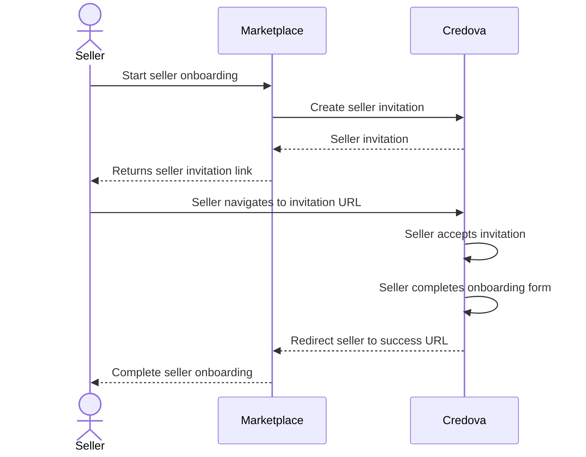

import { Alert } from "@site/src/components/shared/Alert";
import GettingStartedSection from "@site/src/components/docs/_getting-started-section.mdx";

# Onboarding Sellers

In this guide, we will walk through the process to invite and onboard a seller for your marketplace.



## Getting Started

<GettingStartedSection />

### Get your Secret Key

Next you will need your `Secret Key`. [Go to your Developers section](https://portal.credova.com/developers/api-keys) and click `Reveal` for your `Secret Key` and copy the value.

<Alert>Save the Secret Key as it will be used in the next steps of this guide.</Alert>

## Inviting a Seller

[Connections](/concepts/connections) are the key link between one or more [Accounts](/concepts/accounts). This enables a merchant to be able to collect payments from a customer and distribute the funds to one or more sellers.

In order to connect a merchant and seller, we first need to [create a connection invitation](/api/create-connection-invitation).

```shell showLineNumbers
curl 'https://api.credova.com/connection-invitations' \
-X 'POST' \
-H 'X-API-KEY: <API_KEY>' \
-H 'Content-Type: application/json' \
-d '{
  "success_url": "https://merchantwebsite.com/success",
  "error_url": "https://merchantwebsite.com/error"
}'
```

In this request, we are passing in two parameters, a `success_url`, which is where we want to send the seller after they successfully completed onboarding and an `error_url` where we will send them if there is a problem during onboarding.

The connection invitation should contain an `invitation_url` where we will send the seller to accept the invitation and complete their onboarding:

```json showLineNumbers
{
  "id": "conn_41vV8UVXrEgpT5AWYr2ry4SKN",
  "account_id": "acc_B518niGwGYKzig6vtrRVZGGGV",
  "account_name": "Test Company, LLC",
  "status": "pending",
  //highlight-next-line
  "invitation_url": "https://portal.credova.com/connections/invitations/invt_41vV8UVXrEgpT5AWYr2ry4SKN?merchant_name=Test%20Company",
  "created_at": "2024-06-30T01:02:29.212Z",
  "modified_at": "2024-06-30T01:02:29.212Z",
  "success_url": "https://merchantwebsite.com/success",
  "error_url": "https://merchantwebsite.com/error"
}
```

## Seller Invitation Flow

After a seller has been redirected to the Invitation URL, they will be presented with a screen select an account and accept the invitation.

<div style={{textAlign: 'center'}}>
  
</div>

This will create a [Connection](/concepts/connections) between your Marketplace account and their Seller account.

<div style={{textAlign: 'center'}}>
  
</div>

Once the Seller has completed their onboarding, Credova will redirect the seller back to the `success_url` provided when creating the invitation.

## Getting the Connection

Now that the seller is connected to your account, we can re-use the connection invitation `id` to retrieve the [Connection](/api/get-connection-by-id):

```shell showLineNumber
curl -L 'https://api.credova.com/connections/conn_41vV8UVXrEgpT5AWYr2ry4SKN' \
-H 'Accept: application/json' \
-H 'X-API-KEY: <API_KEY>'
```

This will return a connection containing both the merchant and seller account information as well as the connection status:

```json showLineNumbers
{
  "id": "conn_41vV8UVXrEgpT5AWYr2ry4SKN",
  "merchant_account_id": "acc_B518niGwGYKzig6vtrRVZGGGV",
  "merchant_account_name": "Test Company, LLC",
  "seller_account_id": "acc_8ooQs32UCdriBvrHnVWbTmJbY",
  "seller_account_name": "Widget Store",
  "status": "accepted",
  "created_at": "2024-06-30T01:02:29.212Z",
  "modified_at": "2024-06-30T01:02:29.212Z"
}
```

The `merchant_account_id` is your account ID as the Marketplace. The `seller_account_id` is the account ID of the seller. This is important to store in your system as this will be used later for payment transfers.
The `status` can be one of a few statuses:

| Status      | Description                                                                  |
| ----------- | ---------------------------------------------------------------------------- |
| `accepted`  | The seller has accepted the invitation but has not started onboarding.       |
| `pending`   | The seller has completed onboarding, but their application is in review.     |
| `verified`  | The seller has been successfully onboarded and can not be used for payments. |
| `removed`   | The seller or merchant has removed the connection.                           |

## Subscribing to Seller Notifications

Oftentimes, we want to monitor the status of invitations and our seller connections. In order to do this, we can leverage [Webhooks](/concepts/webhooks).
Webhooks can be configured send notifications for various events such as a connection invitation being accepted, a seller completing onboarding, or a seller removing a connection
with the merchant's account.

```shell showLineNumbers title="Create a Webhook"
curl -L 'https://api.credova.com/webhooks' \
-H 'Content-Type: application/json' \
-H 'Accept: application/json' \
-H 'X-API-KEY: <API_KEY>' \
-d '{
  "url": "https://merchantwebsite.com/notification",
  "event_types": [
    "connection-invitation:accept",
    "connection:update",
    "connection:delete"
  ]
}'
```

This webhook will notify us whenever a connection invitation is accepted, when the seller's status has changed due to completing onboarding, or when either the seller or merchant has removed the connection.

Webhooks are a great way to keep your system in sync with Credova.

## Conclusion

Following this guide, you have successfully invited and onboarded a seller as well as subscribed to notifications related to seller connection activity.
